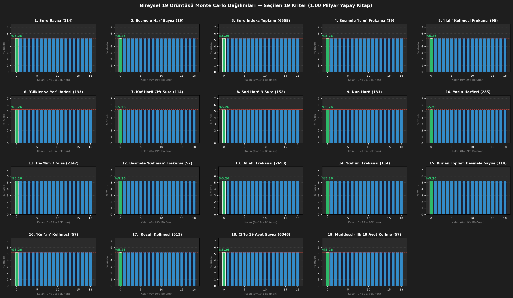

# 🌌 Kur'an 19 Sistemi Kuantum Bilgisayarı ve Stüdyo Arayüz Projesi

Bu proje; Kur'an-ı Kerim metni üzerindeki 19 sistemi iddialarını **Klasik İşlemciler (CPU)**, **AMD Radeon GPU (PyTorch/DirectML)**, **Monte Carlo İstatistiksel Analiz**, **Kuantum Bilgisayarı (Qiskit Grover Algoritması)** ve **Stüdyo Kalitesinde Masaüstü Grafik Arayüzü (CustomTkinter GUI Dashboard)** kullanarak test eden profesyonel bir analiz yazılımıdır.

---

## 🚀 Hızlı Kurulum ve Çalıştırma Talimatı (Quick Start)

### 💻 Yöntem 1: Git Terminal İle Hızlı Kurulum (Tavsiye Edilen)

Terminal veya PowerShell açıp aşağıdaki komut bloklarını sırasıyla çalıştırın:

```bash
# 1. Depoyu İndirin ve Klasöre Geçin
git clone https://github.com/kemaleris8391-dev/19sistem.git
cd 19sistem

# 2. Gerekli Kütüphaneleri Otomatik Yükleyin
pip install -r requirements.txt

# 3. Stüdyo Arayüzünü Başlatın
python studio_app.py
```

---

### 🪟 Yöntem 2: Windows Çift Tıklama İle Otomatik Başlatma

1. GitHub sayfasındaki yeşil **`Code`** butonuna basıp **`Download ZIP`** seçeneğiyle indirin ve klasöre çıkartın.
2. Klasör içindeki **`run.bat`** dosyasına **çift tıklayın**.
3. Sistem tüm bağımlılıkları otomatik kontrol edip stüdyo uygulamasını başlatacaktır.

---

## 🎨 Masaüstü Stüdyo Arayüzü (GUI Dashboard)



### 🌟 Arayüz Özellikleri (7 Bağımsız Sekme):
- **🎛️ Özelleştirilebilir Parametreler:** Test edilecek kitap sayısını (10.000 - 1.000.000.000) slider ile anlık ayarlayın.
- **🎯 Kriter Seçim Menüsü:** Sure sayısı, Besmele harfleri, Ebced değerleri, kelime frekansları (İsim, Allah, Rahman, Rahim) ve özel harfleri seçip kaldırın.
- **🧠 1. Bu Sistemi İnsanın İnşa Etme Olasılığı Sekmesi:** 7. Yüzyıl koşullarında bilgisayarsız bir insanın 19 kilitli çapraz bağımlılık matrisini kurma imkânsızlığını, kognitif bellek sınırlarını (Miller Yasası: 7±2), 23 yıllık parçalı anlatım kısıtını ve Kur'an metin-içi 19 adet harici örneği inceler.
- **📊 2. Bireysel Sistem Grafikleri Sekmesi:** Seçtiğiniz her bir 19 kuralı için ayrı ayrı %5.26 Monte Carlo tesadüf histogramları çizdirilir.
- **🌌 3. Birleşik (Kombine) Olasılık Grafiği Sekmesi:** Seçtiğiniz tüm kuralların **aynı anda (simultaneously)** gerçekleşme ihtimalini ($1/19^K$) logaritmik düşüş grafiğiyle gösterir.
- **⚛️ 4. Kuantum Grover Algoritması Sekmesi:** Qiskit ile 5 Kübitlik kuantum süperpozisyonunda Grover devresini canlandırır.
- **✨ 5. Çifte 19 Kilit Simetrisi & Mushaf Raporu Sekmesi:** Analiz sonuçlarını Tevbe 128-129 Dahil/Hariç karşılaştırmalı detaylı metin raporu ve Besmele devasa kodu ile sunar.
- **🪐 6. Kozmik Zaman & Evren Analojisi Sekmesi:** 8 Milyar insanın saniyede 1 kitap yazarak 13.8 Milyar Yıl boyunca üreteceği ~3.48×10²⁷ kitap kapasitesi ile $19^K$ olasılık boyutunu kıyaslar ve canlı üretim sayacı sunar.
- **📐 7. İstatistiksel Doğrulama Paneli Sekmesi:** Chi-Square, Z-Skoru, Bootstrap %95 GA, Bayesian Posterior, Shannon Entropi ve Kontrol Sayısı Testi dahil 19 bağımsız akademik yöntemi analiz eder.

---

## 📁 Proje Dosya Yapısı

| Dosya | Açıklama |
| :--- | :--- |
| 🎛️ [`studio_app.py`](studio_app.py) | **Stüdyo Kalitesinde Masaüstü GUI Arayüzü:** 7 Sekmeli CustomTkinter + Matplotlib analiz ve grafik dashboard'u. |
| ⚡ [`run.bat`](run.bat) | **Windows Otomatik Başlatıcı:** Çift tıklama ile kütüphaneleri kontrol edip uygulamayı çalıştırır. |
| 📋 [`requirements.txt`](requirements.txt) | **Bağımlılık Listesi:** Proje için gerekli tüm Python kütüphaneleri. |
| 🪐 [`kozmik_19_simulasyonu.py`](kozmik_19_simulasyonu.py) | **Kozmik Zaman & Evren Analojisi Betiği:** 8 Milyar insan x 13.8 Milyar yıl vs 19^K imkânsızlık hesaplayıcısı. |
| ⚛️ [`quantum_19_grover.py`](quantum_19_grover.py) | **Qiskit Kuantum Devresi:** 5 Kübitlik kuantum süperpozisyonu ve Grover arama algoritması ile 19 durumunu (`\|10011\>`) tespit eder. |
| 📖 [`quran_full_analyzer.py`](quran_full_analyzer.py) | **Metin Analiz Motoru:** Sure sayısı, Besmele harfleri ve kelime frekansları için tam kat testleri yapar. |
| 📜 [`quran_real_text_analyzer.py`](quran_real_text_analyzer.py) | **Gerçek Metin Veri Seti:** Kur'an-ı Kerim yapısal metin verileri ve sayımları. |
| 📊 [`monte_carlo_visualizer.py`](monte_carlo_visualizer.py) | **İstatistik & Görselleştirme:** Monte Carlo P-Değeri ve Z-Skoru hesaplar. |
| ⚡ [`gpu_amd_19_sim.py`](gpu_amd_19_sim.py) | **AMD GPU Hızlandırma:** PyTorch DirectML kullanarak AMD Radeon ekran kartlarında simülasyon yapar. |
| 🚀 [`cpu_19_sim.py`](cpu_19_sim.py) | **Multi-core CPU Simülasyonu:** Vektörize NumPy işlemleriyle CPU'da saniyede ~4.8 Milyon kitap analiz eder. |
| ✅ [`verify_all_19_criteria.py`](verify_all_19_criteria.py) | **19 Kriter Doğrulayıcı:** 19 Kriterin matematiksel tam tutarlılık test aracı. |

---

## 💻 Çalıştırma Komutu

```bash
# Profesyonel Masaüstü Stüdyo Arayüzü
python studio_app.py
```
